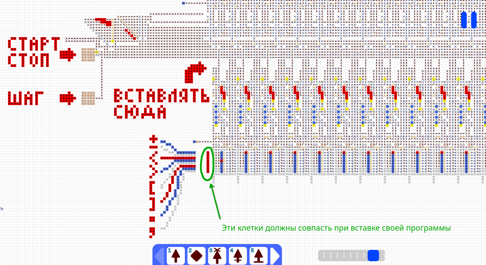
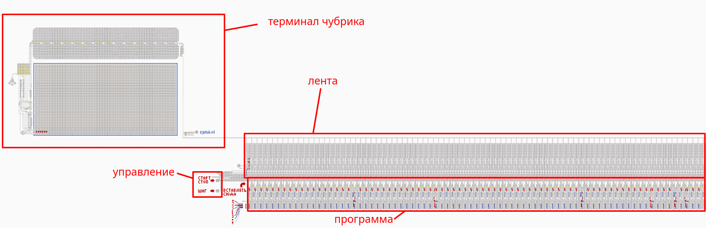
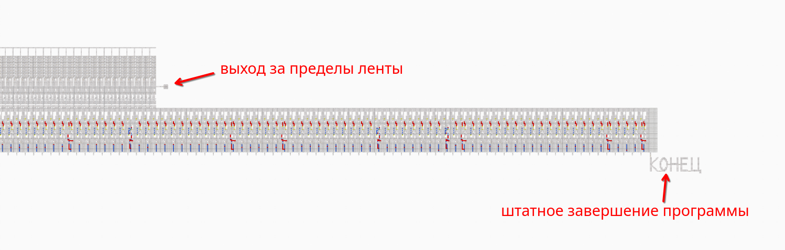
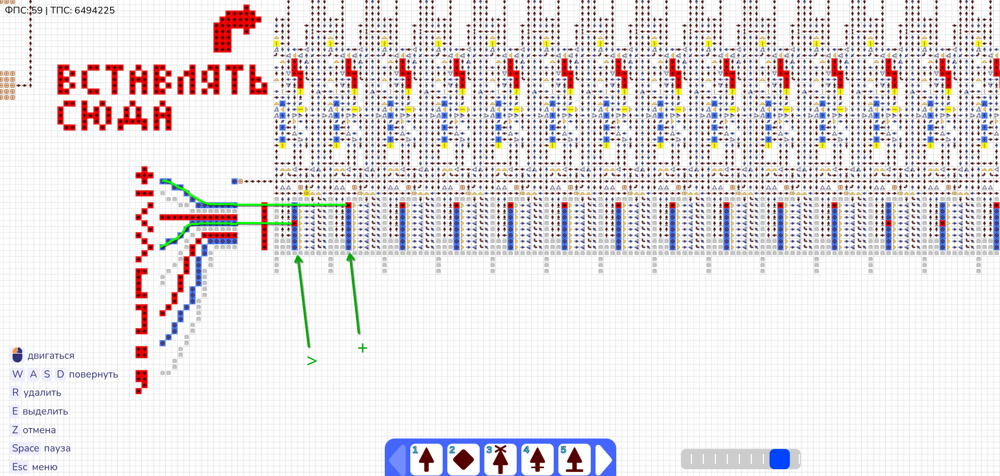

# BrainfuckArrows

Это проект - реализация полноценного интерпретатора эзотерического языка программирования [brainfuck](https://ru.wikipedia.org/wiki/Brainfuck) в клеточном автомате под названием "[стрелочки](https://ru.wikipedia.org/wiki/%D0%9A%D0%BB%D0%B5%D1%82%D0%BE%D1%87%D0%BD%D1%8B%D0%B9_%D0%B0%D0%B2%D1%82%D0%BE%D0%BC%D0%B0%D1%82)".

Brainfuck является полным по Тьюрингу языком, это означает, что этот интерпретатор по сути является компьютером.

**Гитхаб:** https://github.com/IvanSakaev/BrainfuckArrows

## Соответствие стандарту brainfuck
Интерпретатор соответствует стандарту языка программирования brainfuck за исключением отсутствия команды `,`

Особенности интерпретатора:
- Отсутствует `,`
- Размер ленты - 256 ячеек (при нехватке можно скопировать)
- Ячейки ленты беззнаковые размером 1 байт (значения от 0 до 255)
- При переполнении ячейки вверх ее значение становится равно нулю
- При переполнении ячейки вниз ее значение становится максимальным (255)
- При выходе за границы ленты программа завершается с ошибкой
- Длина программы не ограничена

## Клеточный автомат
Правила работы: https://www.youtube.com/watch?v=q_ve9SsuyvU

Сайт игры: https://logic-arrows.io (Если не работает, попробуйте включить ВПН)

Дискорд игры: https://discord.com/channels/1139657094459560006

## Запуск
> Для запуска очень рекомендуется установить [мод на оптимизацию](https://discord.com/channels/1139657094459560006/1402026791568412712/1429486077953048767) в качестве расширения в браузере. Он ускоряет работу в ~10000 раз. Без него почти невозможно запустить никакую программу, т.к. brainfuck - сам по себе медленный язык, а здесь он запускается еще и в довольно медленных стрелочках.
Если не хочется устанавливать мод, можете посмотреть фото и видео работы интерпретатора.

### Запуск с модом
- Скачайте [мод](https://discord.com/channels/1139657094459560006/1402026791568412712/1429486077953048767) и установите его в качестве расширения для браузера. Для firefox используйте [tampermonkey](https://www.tampermonkey.net/).
- [Откройте карту в старой версии игры](https://v1_2.logic-arrows.io/map-WxVQG_tC) (мод не поддерживает новую версию, но в ней почти ничего не изменилось).
- Необходимо нажать кнопку `P` для компиляции карты. При внесении изменений в карту (кроме нажатий внутриигровых кнопок) надо будет нажать `P` снова.
- Выкрутите ползунок скорости на значение `MAX TPS` (предпоследнее).
- Нажмите на карте кнопку с надписью `СТАРТ СТОП`.
- Программа запущена

### Запуск без мода
- [Откройте карту](https://logic-arrows.io/map-WxVQG_tC).
- Выкрутите ползунок скорости на значение `1200` (при сильных лагах можно уменьшить).
- Нажмите на карте кнопку с надписью `СТАРТ СТОП`.
- Очень долго ждите или установите мод.

### Видеозапись работы
[Видеофайл mp4](./interpreter/fibonacci.mp4)
[Ссылка на youtube](https://www.youtube.com/watch?v=dJi277lKh8Q)

## Brainfuck программа

### Начальная программа
В качестве примера используется программа поиска чисел Фибоначчи и вывода их на экран в десятичной системе. Она выводит первые 50 чисел (до 20365011074 включительно).
- [Программа](./brainfuck_to_arrows/fibonacci.b)
- [Стрелочки для вставки в интерпретатор](./brainfuck_to_arrows/Prime.b.txt)

Также есть программа поиска простых чисел, но она работает крайне медленно даже с модом.
- [Программа](./brainfuck_to_arrows/Prime.b)
- [Стрелочки для вставки в интерпретатор](./brainfuck_to_arrows/Prime.b.txt)

### Использование своей программы
Для того, чтобы запустить свою brainfuck программу на этом интерпретаторе, нужно:
- Скачать и установить python с сайта https://python.org
- Скачать этот git репозиторий
- Перейти в папку `brainfuck_to_arrows` и запустить файл `main.py`
- Ввести путь к файлу с brainfuck-кодом
- Появится файл с тем же названием, но с расширением `.b.txt`
- Нужно открыть его и скопировать содержимое
  - Стандартный блокнот Windows может зависнуть при большом размере файла, используйте более адекватный редактор
- Дальше откройте карту с интерпретатором в стрелочках
- Нажмите сочетание клавиш `Ctrl+V`
- Наведите курсор примерно на конец стрелки с надписью `ВСТАВЛЯТЬ СЮДА`, так, чтобы обведенная часть совпала и кликните

- Программа установлена, можно запускать.

## Описание интерпретатора

Для задания команды используются источники сигнала (:source:). Однотактовые источники (:pulse:) не влияют на программу и используются для красоты.

Положение источника сигнала определяет команду. Слева от программы нарисовано, какой команде соответствует какое положение источника сигнала.

## Используемые ресурсы
- Дисплей для стрелочек: https://logic-arrows.io/map-TOpD4zAd (Он является частью [компьютера](https://discord.com/channels/1139657094459560006/1300762817238011934) от того же создателя `chubrik`)
- Библиотека для работы с сохранениями на Python. Я слегка модифицировал ее. https://discord.com/channels/1139657094459560006/1184800735653801994
- Brainfuck программа поиска чисел Фибоначчи для примера: https://vad-a.livejournal.com/58242.html
- [Программа поиска простых чисел](./brainfuck_to_arrows/Prime.b) от автора https://www.linusakesson.net/programming/brainfuck/index.php
